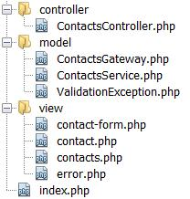

# CRUD with PHP OOP and MVC Design Pattern

References:

- [https://github.com/keefekwan/php_crud_mvc_oop](https://github.com/keefekwan/php_crud_mvc_oop)
- [http://www.w3programmers.com/crud-with-php-oop-and-mvc-design-pattern/](http://www.w3programmers.com/crud-with-php-oop-and-mvc-design-pattern/)

Simple CRUD application for adding in contacts (name, phone, email and address)for practice in OOP while using
the [MVC design pattern](https://en.wikipedia.org/wiki/Model%E2%80%93view%E2%80%93controller)
and [Table Data Gateway](https://en.wikipedia.org/wiki/Table_data_gateway).

The **index.php** script is central access point, all requests go through it.

The **controller** is defined in the controller directory:

- ContactsController.php file.

Application **views** are defined in the view directory:

- contact-form.php is responsible for displaying “Add new contact” form to the user
- contact.php is responsible for displaying contact details, contacts.php is responsible for displaying the contacts
  list
- error.php is responsible for diplaying errors.

The **model** is defined in the model directory. It consists of three parts:

- ContactsGateway.php is a table data gateway to the database table I’ll show you later, the
- ContactsService.php object defines the model API that is used by the controller.
- ValidationException.php is an exception thrown from the model and catched by the controller in case of any validation
  errors. Using the ValidationException the model can alert the controller about validation errors and the controller
  can pass them to the view so they can be displayed.

The model has a single entity – Contact which is persisted in the contacts table. The Contact has no behavior so I used SQL table structure to define it:

~~~
create table contacts (
  id INT AUTO_INCREMENT PRIMARY KEY,
  name VARCHAR(50),
  phone VARCHAR(50),
  email VARCHAR(50),
  address VARCHAR(50)
);
~~~